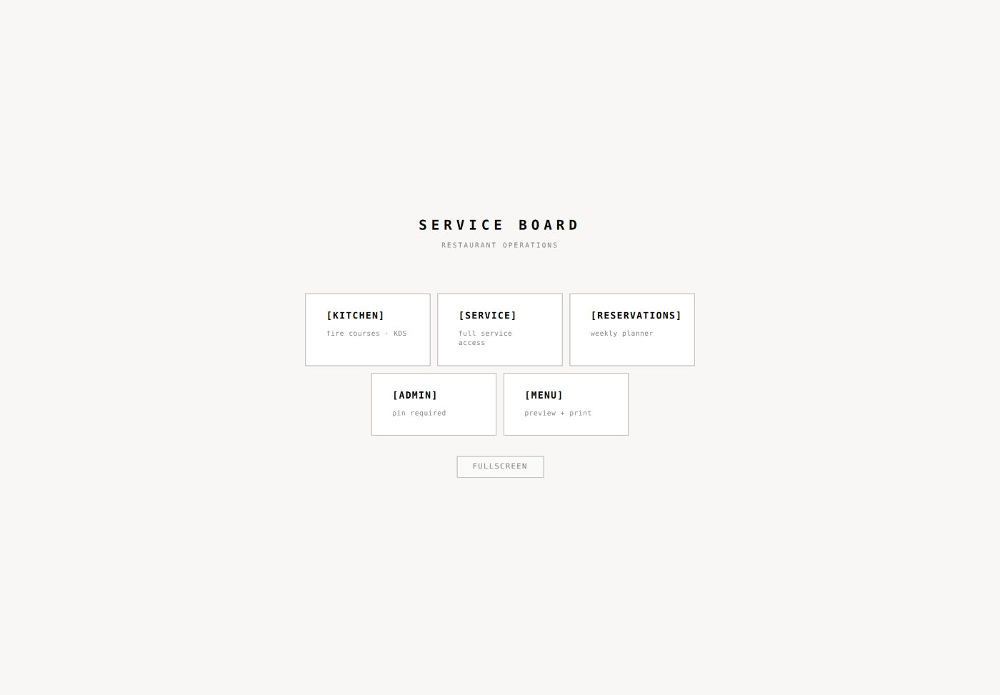
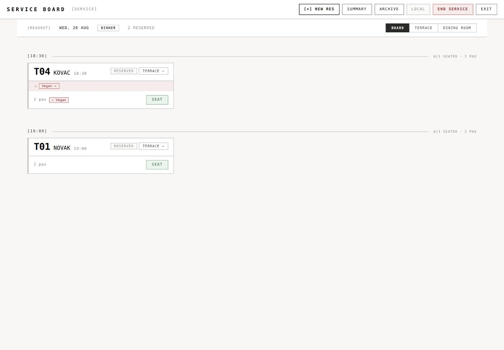
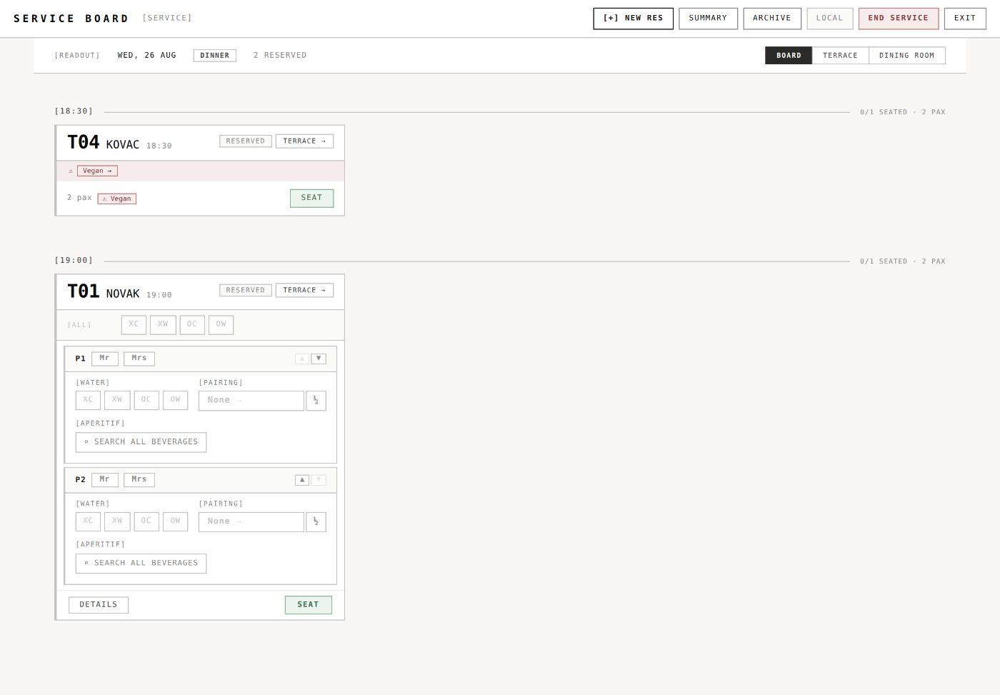
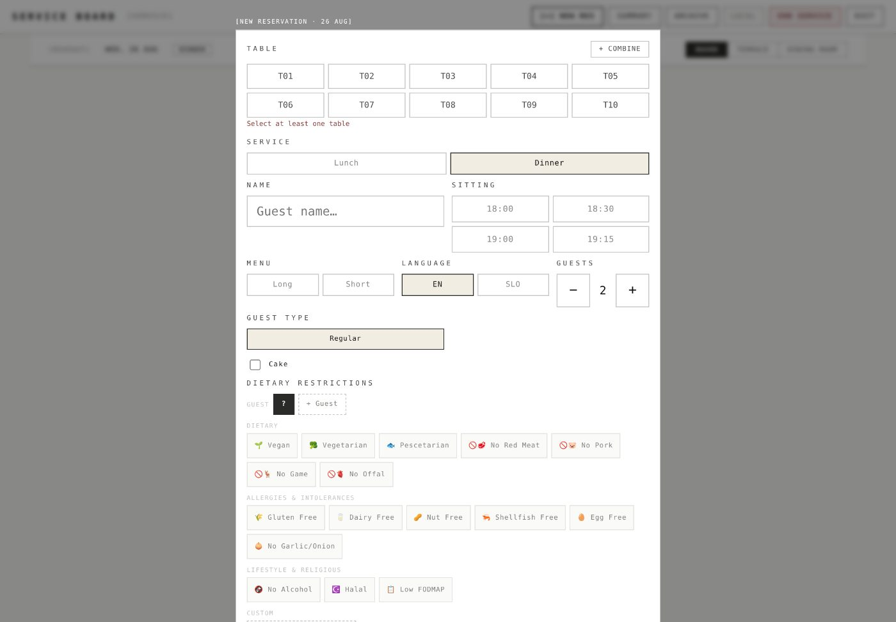
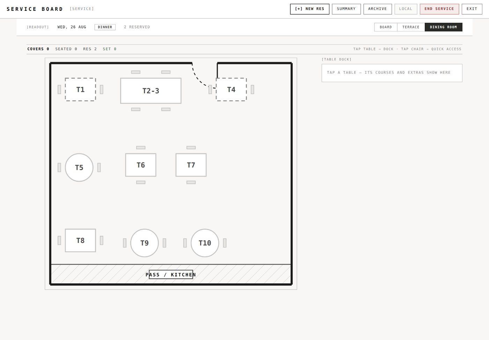
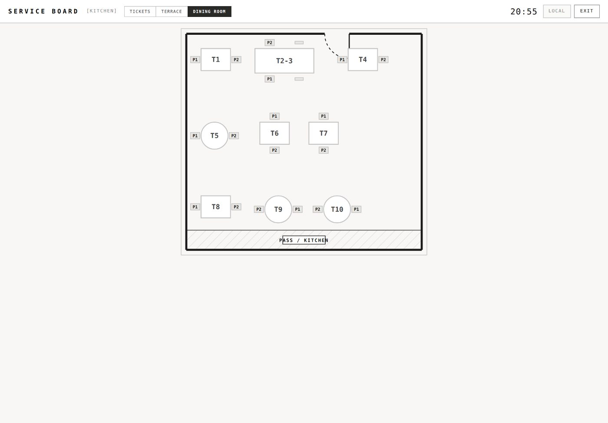
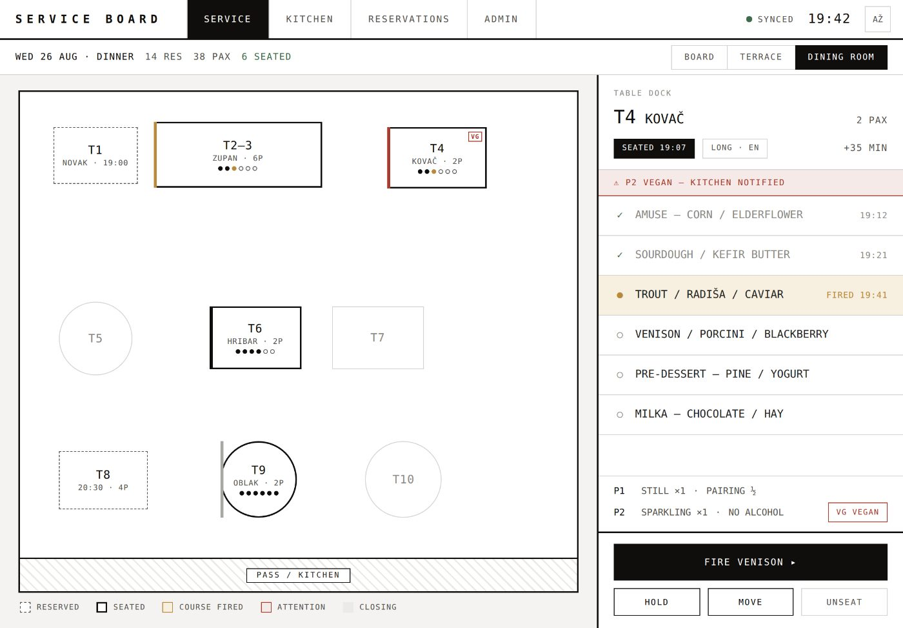
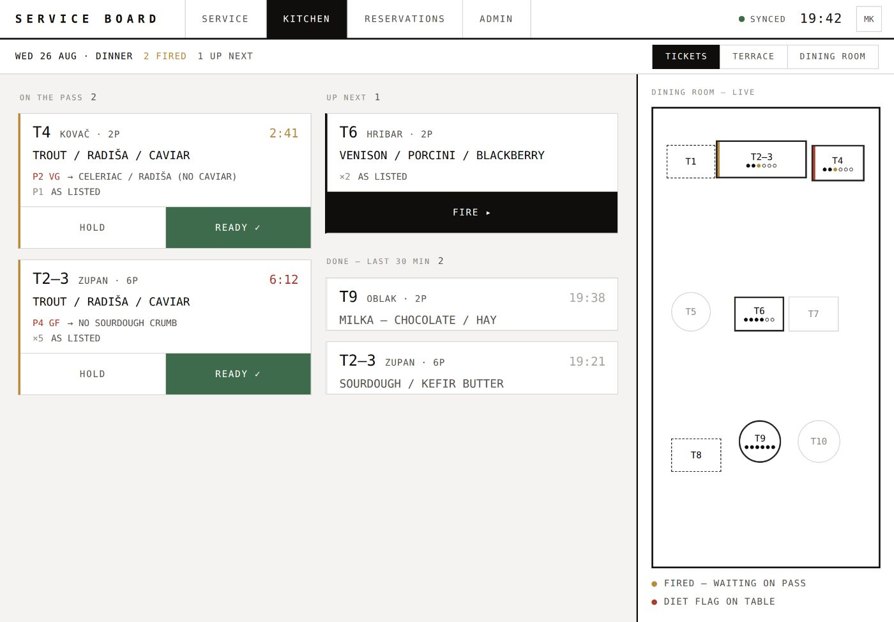
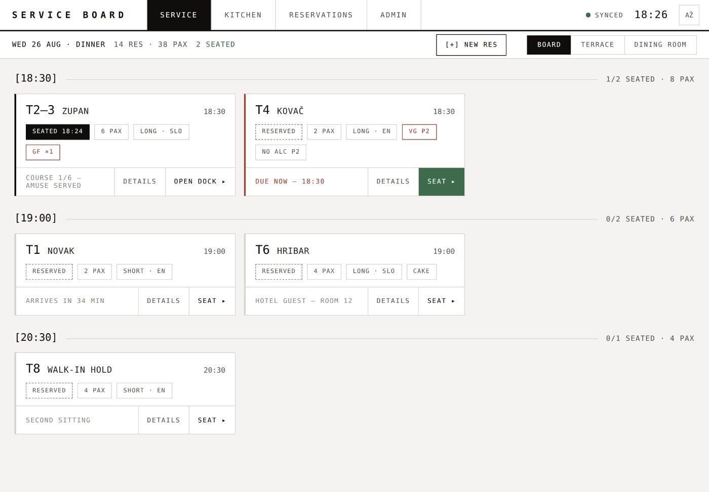
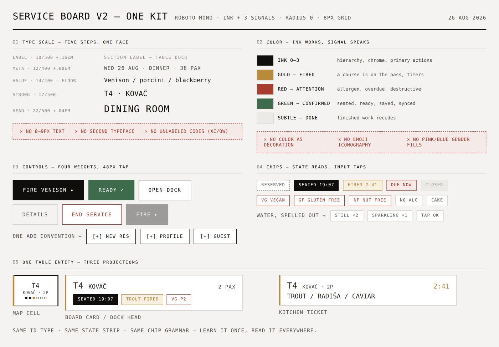

# Service Board V2 — UX/UI research: one board, one grammar

**Date:** 2026-08-26 · **Typeface decision:** Roboto Mono, everywhere ·
**Mockups:** [`docs/design-v2/`](design-v2/) (self-contained HTML, open in any browser)

## Verdict

The app does not need a new look — it needs its one good look everywhere.
The newest screens already speak a strong language: Roboto Mono, warm paper,
hairline rules, zero radius. V2 should promote that language from "the newest
layer" to *the only layer*: **one shell, one table grammar, one kit** — and
delete the other two design generations still living in the code.

The evidence below comes from running the app end-to-end (all five modes,
seeded service with reservations) and auditing the styling code.

## What's fragmenting today

| # | Finding | Severity | Evidence |
|---|---------|----------|----------|
| 1 | **Five silos, no shared shell.** Kitchen / Service / Reservations / Admin / Menu are entered from a hub and exited back through it. Navigation lives somewhere different in each: buttons top-right (Service), EXIT top-left (Reservations), hover rail (Admin), in-header tabs (Kitchen). ARCHIVE is reachable from four different places. | HIGH | fig. A, B, E |
| 2 | **One table, three unrelated drawings.** The same table renders as a board card (RESERVED chip + SEAT), a floor shape (dashed outline), and kitchen P1/P2 chips — different labels, states, and visual weight per surface. | HIGH | fig. B, E, F |
| 3 | **Cryptic codes at the point of service.** The seat editor speaks XC / XW / OC / OW, ½, Mr/Mrs, P1/P2 with no on-screen legend. New staff can't self-serve. | HIGH | fig. C |
| 4 | **Two token systems + ~65 raw hex colors.** `src/styles/tokens.js` holds two palettes (`neutral/charcoal/green/red` vs. `ink/signal`), two spacing scales, two type scales, plus legacy aliases — and components still hand-roll ~65 distinct hex values despite the file's own "no raw hex" rule. Drift is structural. | MED | `src/styles/tokens.js` |
| 5 | **Emoji break the monochrome system.** Dietary chips use color emoji (🌱 🥦 🚫🥩 ☪️), the admin pin is 📌, while everything else is strict mono glyphs. Emoji ignore the ink color and shout over real signals. | MED | fig. D |
| 6 | **Type below the operational floor.** Tokens define 8–9 px steps; many controls sit under 48 px. Dim dining room + arm's length says no. (WCAG 2.5.8 minimum 24 px; Apple 44 pt; Material 48 dp.) | MED | `tokens.js` `fontSize.xs/sm` |

### Current UI (as running)

| | |
|---|---|
|  **A — entry hub.** Handsome, but every mode switch returns here. |  **B — service board.** Card grammar #1; actions crowd top-right. |
|  **C — seat editor.** XC/XW/OC/OW/½ with no legend. |  **D — new reservation.** Color emoji inside a mono system. |
|  **E — dining room.** The strongest current screen; v2 builds on it. |  **F — kitchen floor.** Third drawing of the same tables. |

## The direction — Operational Ledger

Directions considered: friendly-POS (Toast/Square-like), dark KDS console, and
the documentation-grade mono ledger the newest screens already reach for. The
ledger fits best: it suits a fine-dining room (quiet, precise,
printed-menu adjacent), it's the current "technical mono" direction in
interface design rather than a retro affectation, and it's the cheapest to
reach because it's half-built. V2's real work is **unification**:

1. **One shell, four rooms.** Persistent top bar: SERVICE · KITCHEN ·
   RESERVATIONS · ADMIN always one tap away (role-filtered; Admin keeps its
   PIN). Date, session, sync, and clock live in one fixed context strip. No
   exit-to-hub round-trips.
2. **One table entity, three projections.** Map cell, board card, and kitchen
   ticket are the same component at three sizes: same ID type, same left
   state strip, same chip grammar, same course dots.
3. **Ink works, signal speaks.** Everything neutral is ink. Exactly three
   signals: **gold** = fired/on the pass, **red** = attention (allergen,
   overdue, destructive), **green** = confirmed (seated, ready, synced). Done
   work fades to subtle. No pink/blue gender fills, no emoji, no color as
   decoration.
4. **Words over codes.** `STILL ×2`, `SPARKLING`, `VG VEGAN`, `GF GLUTEN
   FREE`. Every abbreviation carries its word. 14 px operational floor,
   48 px tap targets, tabular numerals for every time and count.
5. **One kit in code.** Collapse `tokens.js` to a single system (ink + 3
   signals, five type steps, one spacing scale), delete legacy aliases, and
   enforce "no raw hex outside tokens" with a lint rule.

## V2 mockups (Roboto Mono, HTML in `docs/design-v2/`)

*Service · dining room — one shell on top; map + table dock share the entity
grammar; FIRE is the one primary action.*

*Kitchen · pass — tickets are the same card at kitchen scale; gold timer, red
when late; 54 px READY.*

*Service · board — sitting groups, readable chips, one add-convention, SEAT in
confirm-green only when due.*

*One kit — five type steps, ink + three signals, four control weights, chip
grammar, one entity × three projections.*

## What the research says

- **KDS practice:** timer-driven color urgency and large tap targets are the
  consistent pattern; case studies call out over-used red, weak hierarchy,
  and small fonts as classic failures — exactly what "three signals + 48 px"
  protects against.
  ([case study 1](https://medium.com/@osamahaashir/cooking-up-success-revamping-kitchen-display-system-kds-ux-case-study-6a6c92784fb9),
  [case study 2](https://gwenndesign.medium.com/product-design-case-study-kitchen-display-system-52a5e9cab81e),
  [KDS guide](https://www.webstaurantstore.com/article/1002/kitchen-display-systems.html))
- **Table management:** floor-first products put live state on the map itself
  — guest name on the table, special-status outline — and treat the floor as
  the primary surface.
  ([SevenRooms](https://sevenrooms.com/platform/table-management/),
  [Resos](https://resos.com/feature/visual-restaurant-table-plan/))
- **Type trend:** "technical mono" is a recognized 2025→2026 direction moving
  from dev tools into mainstream product design; Roboto Mono is current, not
  retro. The risk to manage is legibility — hence the 14 px floor.
  ([font trends 2026](https://madegooddesigns.com/font-trends-2026/),
  [aesthetics 2026](https://aigoodies.beehiiv.com/p/aesthetics-2026))
- **Ergonomics:** WCAG 2.5.8 sets a 24 px legal minimum target size
  (EAA-enforced since June 2025); Apple recommends 44 pt, Material 48 dp. A
  service tablet in a dim room argues for the top of that range.
  ([WCAG 2.5.8 guide](https://silktide.com/accessibility-guide/the-wcag-standard/2-5/input-modalities/2-5-8-target-size-minimum/),
  [implementation guide](https://www.allaccessible.org/blog/wcag-258-target-size-minimum-implementation-guide))
- **Token practice:** migrate shared primitives first (buttons, inputs, type,
  surfaces), then lint so raw values can't return — the same order as the
  rollout below.
  ([martinfowler.com](https://martinfowler.com/articles/design-token-based-ui-architecture.html),
  [feature-sliced](https://feature-sliced.design/blog/design-tokens-architecture))

## Rollout — four contained steps

1. **Collapse the tokens.** One system in `tokens.js`: ink + 3 signals, five
   type steps (10/12/14/17/22), one 8 px spacing scale, 48 px tap constant.
   Keep old keys as deprecated aliases for one release; add the no-raw-hex
   lint.
2. **Build the kit components.** `Button` (primary/confirm/secondary/quiet/
   danger), `Chip` (state/diet/info), `TableEntity` (map/card/ticket sizes),
   `Shell` (top bar + context strip). Pure presentational — no data changes.
3. **Adopt the shell.** Replace the hub + per-mode exits with the persistent
   room bar. The single biggest "not all over the place" win; touches no
   service logic.
4. **Migrate room by room.** Service floor → Kitchen → Board/Reservations →
   Admin, one PR each; retire emoji chips and XC/XW codes as each screen
   lands. Then delete the legacy aliases.

The starting token sheet for phase 1 is `docs/design-v2/tokens.css` — the same
values the mockups run on.
